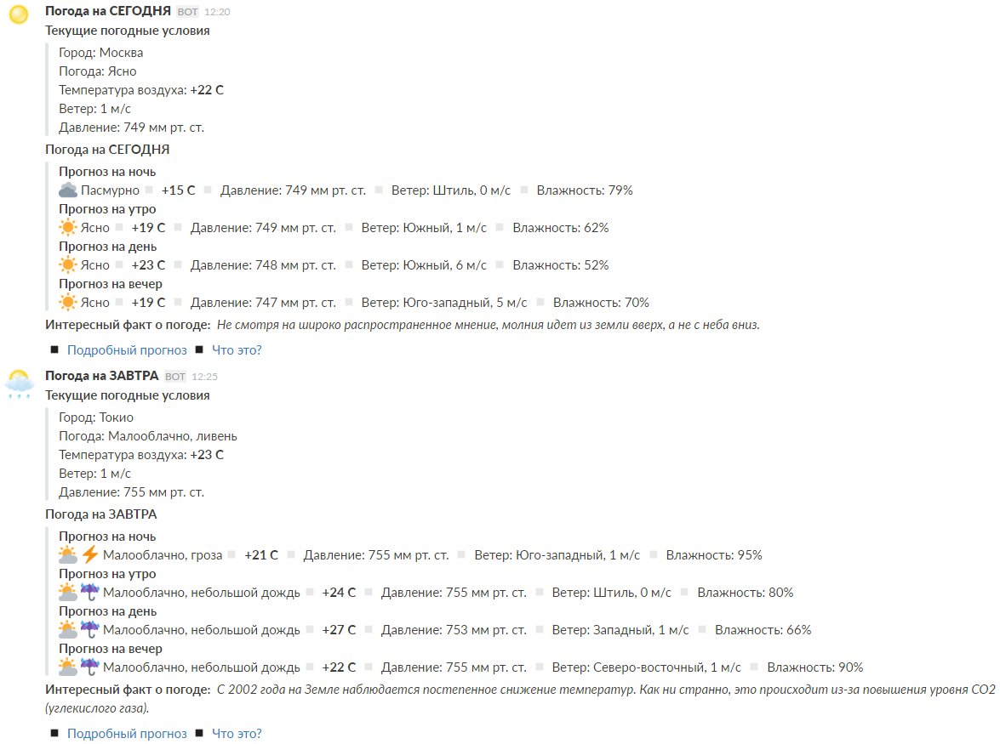

### Погодный БОТ для SLACK

`weather_slack.sh + weather_facts.txt`
#### Описание
Погодный бот для [Slack](https://slack.com). Умеет отправлять прогноз на текущий и следующий день в канал Slack, данные о погоде берёт с gismeteo.ru

* Отображает текущие погодные условия и прогноз на 24 часа
* Отображает прогноз на следующий день
* Иконка (аватар) бота всегда отображает текущие погодные условия
* Данные о давлении, ветре и влажности
* Иконки погодных условий в прогнозе

#### Установка
1. Скопируйте в удобную для вас директорию файл `weather_slack.sh` (например `/home`)
2. Получите **Slack WEB API** (token) здесь https://api.slack.com/web
3. Узнайте код своего города на https://www.gismeteo.ru (он будет указан в конце URL)
3. Отредактируйте файл `weather_slack.sh`
   * Измените значения переменных `token`, `city_code`, `INFO_URL` и `fact_file`
4. Разрешите выполнение скрипта `sudo chmod +x weather_slack.sh`
5. При необходимости скопируйте файл `weather_facts.txt` (по умолчанию скрипт ищёт его в папке `/home`), без этого файла просто не будут отображаться факты о погоде... Может оно вам и не надо

#### Использование

Отправить прогноз погоды на сегодня в канал "general" от имени бота "Погода на СЕГОДНЯ"

`./weather_slack.sh "general" "today" "Погода на СЕГОДНЯ"`

Отправить прогноз погоды на завтра в канал "general" от имени бота "Погода на ЗАВТРА"

`./weather_slack.sh "general" "tommorow" "Погода на ЗАВТРА"`

Имена каналов и ботов можете указывать свои, а так же "повесить" команды на выполнение в **crontab**.

#### Проблемы

* Совершенно точно не идеально определяет какие иконки подставлять в прогнозе на 24 часа... Иногда может вообще этого не сделать :scream:

#### Скриншот

